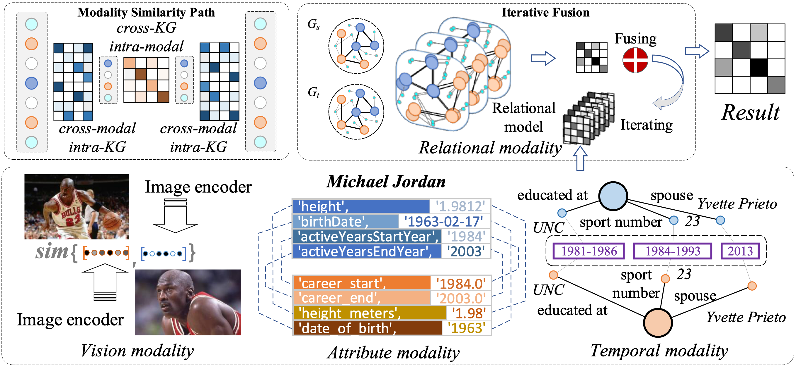

# PathFusion
Source code for the paper "Universal Multi-modal Entity Alignment via Iteratively Fusing Modality Similarity Paths".

Our backbone implementation (structure learning) is built on the source code from [Dual-AMN](https://github.com/MaoXinn/Dual-AMN), Thanks for the work.

## Dependency
* python 3.7+
* pytorch 1.9.0+
* ...

Dependency details can be found in requirement.txt

## Dataset
PathFusion is a unified framework for Multi-modal Entity Alignment. We use two real-world multi-modal datasets, *FB15K-DB15K* and *FB15K-YG15K* (both contains the relational, visual, and attribute modalities.) from paper "[MMKG: Multi-Modal Knowledge Graphs](https://arxiv.org/abs/1903.05485)". We also use two real-world temporal KG datasets *DICEWS* and *WY50K* (both contains the relational and temporal modalities.)

The following is the data folder structure:
```
data
|-- DB15K-FB15K
|   |-- MSP_results
|   |-- attr
|   |-- dev_ent_ids
|   |-- ent_ids_1
|   |-- ent_ids_2
|   |-- ref_ent_ids
|   |-- rel_ids1
|   |-- rel_ids2
|   `-- sup_ent_ids
|-- ICEWS05-15
|   |-- ent_ids_1
|   |-- ent_ids_2
|   |-- ref_pairs
|   |-- rel_ids_1
|   |-- rel_ids_2
|   |-- sup_pairs
|   |-- time_id
|   |-- triples_1
|   |-- triples_2
|   `-- unsup_link
|-- Vis
|   |-- db15k
|   |-- db15k.npy
|   |-- fb15k
|   |-- fb15k.npy
|   |-- yago15k
|   `-- yago15k.npy
|-- YAGO-WIKI50K
|   |-- ent_ids_1
|   |-- ent_ids_2
|   |-- ref_pairs
|   |-- rel_ids_1
|   |-- rel_ids_2
|   |-- sup_pairs
|   |-- time_id
|   |-- triples_1
|   |-- triples_2
|   `-- unsup_link
|-- YAGO15K-FB15K
|   |-- MSP_results
|   |-- attr
|   |-- dev_ent_ids
|   |-- ent_ids_1
|   |-- ent_ids_2
|   |-- ref_ent_ids
|   |-- rel_ids1
|   |-- rel_ids2
|   `-- sup_ent_ids
|-- utils_db.py
`-- utils_yb.py
```

The meanings of each folder are as follows:
```
DB15K-FB15K: processed dataset folder for DB15K-FB15K (Rel, Vis, Attr)
YAGO15K-FB15K: processed dataset folder for YAGO15K-FB15K (Rel, Vis, Attr)
ICEWS05-15: processed dataset folder for ICEWS05-15 (Rel, Temp)
YAGO-WIKI50K: processed dataset folder for YAGO-WIKI50K (Rel, Temp)
Vis: Processed Visual Embedding (using SwinTransformer) for KGs (DB15K, YAGO15K, FB15K) and their adjacency matrix from entity Id to image Id.
MSP_results: MSP result (score matrix for dev seeds) saved on this folder.
```

The meanings of each file are as follows:
```
ent_ids_1: ids for entities in source KG
ent_ids_2: ids for entities in target KG
triples_1: relation triples/quadruple for source KG (quadruple when there is temporal info for relation)
triples_2: relation triples/quadruple for target KG (quadruple when there is temporal info for relation)
rel_ids_1: ids for relations in source KG
rel_ids_2: ids for relations in target KG
sup_pairs: training seeds
ref_pairs: test seeds
ref_ent_ids: all seeds (equals to sup_pairs + ref_pairs)
attr: processed attribute information

db15k: adjacency matrix from entity Id to image Id for DB15K
fb15k: adjacency matrix from entity Id to image Id for FB15K
yago15k: adjacency matrix from entity Id to image Id for YAGO15K
db15k.npy: Visual Embedding for DB15K
fb15k.npy: Visual Embedding for FB15K
yago15k.npy: Visual Embedding for YAGO15K

utils_db.py: data loading script for DB15K-FB15K
utils_yb.py: data loading script for YAGO15K-FB15K
```


The visual embedding and adjacency matrix under the Vis folder are too large to upload through git, and because of the anonymity principle of submission, we cannot provide their corresponding links, so we can only test PathFusion without Vis modality now, and we will upload the corresponding Vis related files after review process to reproduce the effect of the complete PathFusion model. (Our PathFusion model can get SOTA performance even without Vis modality.)


## Quick Start
### To test PathFusion on (DB15K-FB15K, YAGO15K-FB15K)
1. Generate Attr score matrix for test seeds (saved in /data/DATASET_NAME/MSP_results/Attr.npy)
`python MSP_Attr.py --dataset DATASET_NAME`
2. Generate Vis score matrix for test seeds (saved in /data/DATASET_NAME/MSP_results/Vis.npy), which may take several hours.
`python MSP_Vis.py --dataset DATASET_NAME --max_image_num MAX_IMAGE_NUM`
3. Train the model and evaluate it on test seeds, which will uses MSP result /data/DATASET_NAME/MSP_results/*.npy to do IRF process.
`python run.py --dataset DATASET_NAME`

where:
```
DATASET_NAME: DB15K-FB15K or YAGO15K-FB15K, default DB15K-FB15K
MAX_IMAGE_NUM: 1, 2, 3, 4, 5, 6 (represent the max image number for per entity), default 6
```

step 2 is unavailable now due to the lack for Vis related files. we'll upload the corresponding Vis related files after review process to reproduce the effect of the complete PathFusion model.

you can do step 1 and step 3 now. (Our PathFusion model can get SOTA performance even without Vis modality.)

### To test PathFusion on (ICEWS05-15, YAGO-WIKI50K)
`python run_tkg.py --dataset DATASET_NAME --train_ratio TRAIN_RATIO`

where:
```
DATASET_NAME: ICEWS05-15 or YAGO-WIKI50K, default ICEWS05-15
TRAIN_RATIO: 1 for WY50K-5K and DICEWS-1K, 0.2 for WY50K-1K and DICEWS-200
```


